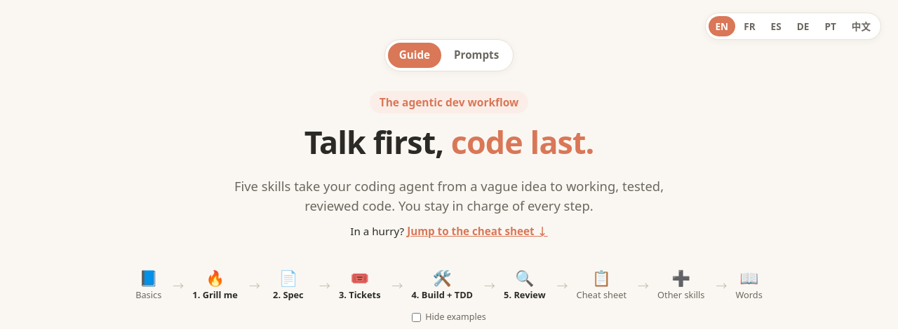

# Talk first, code last

**Your coding agent built the wrong thing again? It's not the agent. It's the order.**

**▶ Read the guide: https://aiverflow.github.io/agentic-dev-workflow/**

Most AI coding goes wrong the same way: you ask, the agent codes, and what comes back
isn't what you meant. This guide flips the order. The agent grills you first, writes
the plan down, cuts it into small tickets, builds each one test-first, then reviews the work.
You stay in charge of every step.

**For you if** you already use a coding agent, and the results are hit or miss.

## What's inside

- **5 steps on one page.** Grill → Spec → Tickets → Build (TDD) → Review. For each step:
  what *you* do, what *the agent* does, and what it looks like on screen.
- **One story all the way through.** Someone keeps stealing lunches from the office fridge.
  Watch the agent build the app to catch them, from its first question
  (*"After two weeks, is it still a lunch, or a science project?"*) to the review that
  catches it adding a fridge camera nobody asked for.
- **A printable cheat sheet** for when you just need the commands.
- **Copy-paste prompts:** explain anything simply, teach it with a diagram,
  get a tour of an unknown repo, or let the agent write your prompt for you.

Works with any coding agent (Claude Code, Codex, Cursor, Hermes Agent…).
Built on [Matt Pocock's skills](https://github.com/mattpocock/skills).

**Read it in:**
[English](https://aiverflow.github.io/agentic-dev-workflow/) ·
[Français](https://aiverflow.github.io/agentic-dev-workflow/index.fr.html) ·
[Español](https://aiverflow.github.io/agentic-dev-workflow/index.es.html) ·
[Deutsch](https://aiverflow.github.io/agentic-dev-workflow/index.de.html) ·
[Português](https://aiverflow.github.io/agentic-dev-workflow/index.pt-br.html) ·
[中文](https://aiverflow.github.io/agentic-dev-workflow/index.zh.html)

## Contributing

Spotted a clumsy translation or a step that lost you? Open an issue or a pull request.

## License

[MIT](LICENSE)
